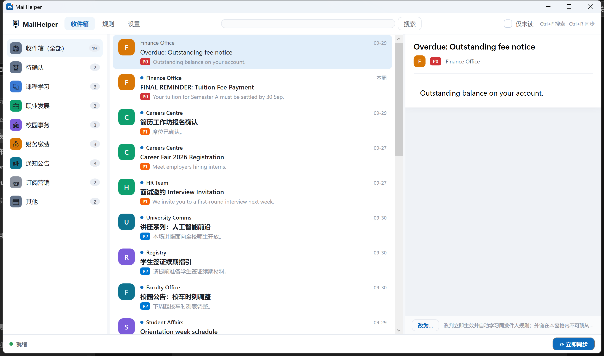

<div align="center">


# MailHelper 邮箱管家

**让港校邮箱里的大事小事，各归其位**

自动同步 · 智能分类 · 重要度标记 · 本地隐私优先

[](https://github.com/tendernessnick/mail_helper/actions/workflows/ci.yml)
[](https://github.com/tendernessnick/mail_helper/releases/latest)
[](#-安装)
[](LICENSE)

**[⬇️ 下载最新版](https://github.com/tendernessnick/mail_helper/releases/latest)** · **[📖 使用手册](docs/使用手册.md)** · **[💬 问题反馈](https://github.com/tendernessnick/mail_helper/issues)** · **[📜 更新日志](CHANGELOG.md)**

</div>

---

> **⚠️ 开始之前**：MailHelper 经**经典版 Outlook**（Office 桌面版自带的 Outlook 桌面客户端）同步学校邮箱。
> 请确认本机已安装经典版 Outlook 并登录了学校邮箱——**新版 Outlook for Windows 与网页版不受支持**。
> 无需任何 OAuth 授权或管理员审批，只要 Outlook 能正常收发邮件，MailHelper 就能工作。

## ✨ 功能特性

| | |
| --- | --- |
| 🗂️ **自动分类** | 本地规则引擎把邮件归入「课程学习 / 职业发展 / 校园事务 / 财务缴费 / 通知公告 / 订阅营销 / 其他」，针对港校邮箱深度调优；证据不足的进「待确认」，绝不静默漏掉 |
| 🚦 **重要度分级** | 每封邮件标注 P0（紧急）～ P3（低），缴费截止、面试邀约一眼锁定 |
| 🔔 **克制的通知** | P0 逐封弹窗、P1 聚合摘要、可设勿扰时段；点击通知直达邮件。不轰炸、不打扰 |
| 🧠 **越用越懂你** | 一键「改为…」纠正分类，同发件人自动学习；规则编辑器带试跑预览，改错零风险 |
| 🔍 **全文搜索** | 主题 / 发件人 / 正文即时检索（`Ctrl+F`），配合「仅未读」快速清零 |
| 🗃️ **自定义类别** | 名称 + 图标 + 颜色随心建，分类栏 / 改判菜单 / 规则全联动 |
| 🔄 **应用内更新** | 「检查更新」→ 后台增量下载 → 一键重启安装，永远保持最新正式版 |
| 🫥 **托盘常驻** | 关窗不退出、未读角标、开机自启，安静值守 |
| 🔒 **隐私优先** | 邮件数据全本地、分类全本地、零遥测、不存任何凭据、正文外链一律不跳转 |

## 📸 界面预览



*侧边分类导航 + 邮件列表 + 阅读窗格：未读数、重要度标签、附件提示一目了然*

## 📥 安装

| 项目 | 要求 |
| --- | --- |
| 操作系统 | Windows 10 (19041+) / Windows 11 |
| **邮箱通道** | **经典版 Outlook**（Office 桌面版）已登录学校邮箱；不支持新版 Outlook for Windows / 网页版 |
| 运行时 | 无需预装 .NET（自包含发布）；WebView2 Runtime（Win11 内置，个别精简版 Win10 可[官方下载](https://developer.microsoft.com/microsoft-edge/webview2/)） |

1. 从 [**Releases 最新正式版**](https://github.com/tendernessnick/mail_helper/releases/latest) 下载 `MailHelper-stable-Setup.exe`
2. 双击安装（未签名程序 SmartScreen 会提示一次：「更多信息」→「仍要运行」；校验值见发布页 `SHA256SUMS.txt`）
3. 免安装场景可用同页的 `MailHelper-stable-Portable.zip`（更新需手动重下）

## 🚀 快速上手

1. 打开经典版 Outlook，确认学校邮箱能正常收发
2. 启动 MailHelper，勾选《隐私说明》，点 **「连接学校邮箱」**——自动识别 Outlook 里的学校账户并开始首轮同步
3. 邮件到齐后自动完成分类与重要度标注，开始定时增量同步（默认每 5 分钟）
4. 发现分错？选中邮件点 **「改为…」** 选对类别即可，同发件人从此自动归对

更多细节（通知策略、规则编辑、勿扰时段、常见问题）见 **[📖 使用手册](docs/使用手册.md)**。

## 🔄 保持更新

应用内 **设置 → 关于 → 检查更新**：发现新版本自动后台增量下载，一键重启安装，数据与设置全保留。
只接收正式版；喜欢尝鲜可关注 [Releases 页的 Pre-release](https://github.com/tendernessnick/mail_helper/releases)。

## 🛠️ 从源码构建

```bash
dotnet restore MailHelper.sln
dotnet build MailHelper.sln -c Release      # 0 警告 0 错误（TreatWarningsAsErrors）
dotnet test MailHelper.sln -c Release       # 全量测试（UI 冒烟需 Windows 桌面会话）
```

- 无需真实账号的体验模式：`MAILHELPER_DEV=1` 启动即用种子数据驱动全链路
- 数据目录：`%AppData%\MailHelper\`（可用 `MAILHELPER_DATA_DIR` 覆盖）

## 🗺️ 路线图

- [ ] 感知远端删除与移动（当前网页版删除的邮件不会从本地消失）
- [ ] 更多港校 / 专业的分类规则包
- [ ] 英文界面文案完善

> 有需求或想法？欢迎[提 Issue](https://github.com/tendernessnick/mail_helper/issues)。

## 🤝 参与贡献

欢迎 Issue 反馈缺陷与建议；PR 请先开 Issue 对齐方向。提交规范与分支策略见 [08-构建发布与运维手册](docs/08-构建发布与运维手册.md)。

## 📄 许可证

[MIT](LICENSE) © tendernessnick。使用了以下优秀的开源组件：Velopack、CommunityToolkit.Mvvm、EF Core (SQLite)、Serilog、H.NotifyIcon.Wpf、WebView2 等。

---

<div align="center">

如果 MailHelper 帮到了你，欢迎点一个 ⭐ Star —— 这是对独立开发者最好的鼓励。

</div>

<details>
<summary><b>📂 项目内部文档（工程书 / 约定 / 进度）</b></summary>

| 编号 | 文档 | 用途 |
| --- | --- | --- |
| 01 | [项目立项说明书](docs/01-项目立项说明书.md) | 背景、目标、范围、可行性 |
| 02 | [需求规格说明书](docs/02-需求规格说明书.md) | 用户故事、用例、功能/非功能需求 |
| 03 | [系统架构设计说明书](docs/03-系统架构设计说明书.md) | 总体架构、ADR、模块划分、分类引擎 |
| 04 | [详细设计说明书](docs/04-详细设计说明书.md) | 数据库、接口、类设计、错误处理 |
| 05 | [UI-UX 设计说明](docs/05-UI-UX设计说明.md) | 信息架构、界面原型、交互与视觉 |
| 06 | [测试计划](docs/06-测试计划.md) | 测试策略、用例、发布门禁 |
| 07 | [项目计划与风险管理](docs/07-项目计划与风险管理.md) | 里程碑、Sprint 排期、风险登记 |
| 08 | [构建发布与运维手册](docs/08-构建发布与运维手册.md) | 分支策略、CI/CD、打包签名 |
| 09 | [安全与合规](docs/09-安全与合规.md) | 威胁建模、数据安全、PDPO/GDPR |

其他：[发布操作指南](docs/发布操作指南.md)（维护者发版流程）· [工程约定与术语表](docs/工程约定与术语表.md) · 进度事实源 [PROGRESS.md](PROGRESS.md)（S0~S16）

</details>
