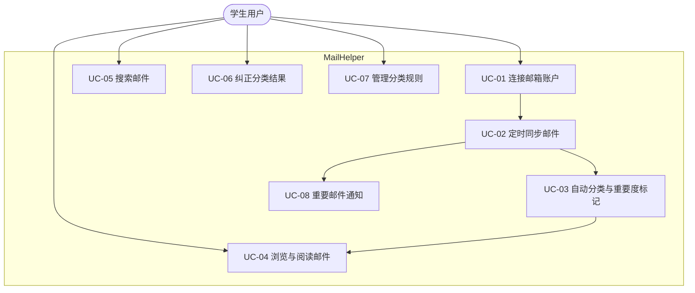

# 02 需求规格说明书（SRS）

| 文档编号 | MH-SRS-02 | 版本 | v1.0 |
| --- | --- | --- | --- |
| 作者 | 产品/开发 | 状态 | 待评审 |
| 创建日期 | 2026-09-26 | 上游文档 | [01 项目立项说明书](01-项目立项说明书.md) |
| 评审记录 | 无（首次提交） | 下游文档 | 03 架构 / 04 详细设计 / 06 测试计划 |

---

## 1. 引言

### 1.1 编写目的

定义 MailHelper v1.0 的功能需求与非功能需求，作为设计、开发、测试与验收的基线。需求变更须经 [07 项目计划 §变更管理](07-项目计划与风险管理.md) 流程审批。

### 1.2 读者对象

产品、开发、测试、UAT 参与者。

### 1.3 需求优先级定义（MoSCoW）

| 级别 | 含义 | 交付要求 |
| --- | --- | --- |
| **M**（Must） | 核心价值，缺失则产品不可用 | v1.0 必须交付 |
| **S**（Should） | 重要，但存在临时替代方案 | v1.0 尽量交付，缺省则列入 v1.1 |
| **C**（Could） | 锦上添花 | 资源允许时交付 |
| **W**（Won't，本期） | 明确排除 | 演进路线（见 01 §4.2） |

## 2. 总体描述

### 2.1 产品愿景

让学生打开 MailHelper 即可「一眼看到今天必须处理的事，其余的按图索骥」，代替在混杂收件箱中人工翻找。

### 2.2 运行环境

| 项 | 要求 |
| --- | --- |
| 操作系统 | Windows 10 19041+ / Windows 11（x64、ARM64 可选） |
| 运行时 | .NET 8 Desktop Runtime（自包含发布则无需预装） |
| 浏览器组件 | WebView2 Runtime（Win10 需安装器内置引导安装） |
| 网络 | 可访问 `login.microsoftonline.com`、`graph.microsoft.com` |
| 邮箱 | Office 365 / Exchange Online 学生邮箱 |

### 2.3 约束

- CON-01：仅使用 Graph **委托权限（Delegated）**，不申请应用权限（Application），不做管理员部署前提。
- CON-02：邮件正文、令牌等数据仅存本机（`%AppData%\MailHelper`），不上传任何服务器。
- CON-03：Graph 调用须遵守微软限流策略（429 + Retry-After 退避）。
- CON-04：界面语言首版 zh-CN + en，因港校邮件以英文为主，分类规则需同时支持中英文关键词。

### 2.4 假设与依赖

见 [01 §8](01-项目立项说明书.md)。

## 3. 用户故事

| 编号 | 用户故事 | 优先级 | 关联画像 |
| --- | --- | --- | --- |
| US-01 | 作为新生，我第一次打开软件时能通过向导登录学校邮箱，无需看文档 | M | P1 小林 |
| US-02 | 作为新生，我安装后不配置任何东西，软件就能自动把邮件分成课程/缴费/行政等类别 | M | P1 小林 |
| US-03 | 作为新生，学费截止、签证材料这类邮件要被标为「紧急」并弹系统通知，让我第一时间处理 | M | P1 小林 |
| US-04 | 作为求职季学生，我能单独浏览「职业发展」类邮件，快速筛出实习岗位和面试邀约 | M | P2 阿哲 |
| US-05 | 作为用户，我希望每封邮件有重要程度标记（P0–P3），并能按重要度过滤列表 | M | 全部 |
| US-06 | 作为用户，当软件分类错误时，我能一键改类别，且以后类似邮件不再分错 | S | 全部 |
| US-07 | 作为高级用户，我能添加自定义规则（发件人/关键词/正则），控制分类结果 | S | P3 学姐 |
| US-08 | 作为存量邮件很多的用户，我能等待初次全量同步后，本地搜索任意历史邮件 | M | P3 学姐 |
| US-09 | 作为用户，我关闭窗口后程序留在托盘继续定时同步，新 P0 邮件仍会通知我 | M | 全部 |
| US-10 | 作为用户，我能调整同步频率、关闭开机自启、登出账号 | S | 全部 |
| US-11 | 作为用户，断网或令牌过期后，我能看到明确的错误提示与重试入口，而不是无限转圈 | M | 全部 |

## 4. 用例模型

### 4.1 用例图

### 4.2 用例详述

#### UC-01 连接邮箱账户

| 项 | 内容 |
| --- | --- |
| 参与者 | 学生用户 |
| 前置条件 | 已安装并首次启动；可访问微软登录页 |
| 主流程 | 1. 用户点击「连接学校邮箱」→ 2. 系统浏览器打开 Microsoft 登录页（OAuth 2.0 + PKCE，多租户 `common`）→ 3. 用户输入学校账号并完成 MFA → 4. 用户同意 `User.Read`、`Mail.Read` 权限 → 5. 重定向回本应用，MSAL 换取令牌并 DPAPI 加密缓存 → 6. 显示账户邮箱地址与同步入口 |
| 扩展流 | 3a. 用户取消登录 → 返回引导页，可重试 4a. 租户禁止用户同意（错误 AADSTS 显示需管理员批准）→ 引导「自助注册 Azure 应用」预案向导，或切换 IMAP 兜底 5a. 令牌交换失败 → 显示错误码与帮助链接 |
| 后置条件 | 账户记录入库，进入首次全量同步（UC-02） |

#### UC-02 定时同步邮件

| 项 | 内容 |
| --- | --- |
| 参与者 | 系统（定时器） |
| 前置条件 | 已存在有效账户与令牌 |
| 主流程 | 1. 同步定时器触发（默认 5 分钟）→ 2. 取缓存的 deltaLink，调用 Graph delta query → 3. 分页拉取新增/变更/删除邮件 → 4. 写入本地缓存 → 5. 新邮件送入分类管线（UC-03）→ 6. 保存新 deltaLink 与同步时间 |
| 扩展流 | 2a. 首次同步（无 deltaLink）→ 全量分页拉取收件箱（按页 100 封），界面显示进度且不阻塞浏览 3b. Graph 返回 429 → 按 Retry-After 退避重试（上限 3 次） 2b. 令牌过期 → MSAL 静默刷新；刷新失败（如密码改签）→ 标记账户 `ReauthRequired`，托盘气泡提示重新登录 网络不可用 → 静默跳过本轮，下轮重试，状态栏显示「离线」 |
| 后置条件 | 本地缓存与远端一致；deltaLink 更新 |

#### UC-03 自动分类与重要度标记

| 项 | 内容 |
| --- | --- |
| 参与者 | 系统 |
| 前置条件 | 存在未分类邮件 |
| 主流程 | 1. 取未分类邮件批次 → 2. 预处理（HTML 转纯文本、剥离引文/签名）→ 3. 规则引擎逐条匹配发件人/关键词/正则并加权评分 → 4. 得出类别 + 重要度 + 置信度 → 5. 写回邮件记录，置信度低于阈值的标记「待确认」 |
| 扩展流 | 3a. 无规则命中 → 归入「其他」，P2 |
| 后置条件 | 邮件具备类别与重要度属性 |

#### UC-04 浏览与阅读邮件

| 项 | 内容 |
| --- | --- |
| 参与者 | 学生用户 |
| 前置条件 | 已完成至少一轮同步 |
| 主流程 | 1. 左栏选择类别（或「全部/待确认」）→ 2. 中栏邮件列表（默认按重要度+时间排序），支持按重要度过滤、未读过滤 → 3. 点击邮件，右栏以 WebView2 沙箱渲染 HTML 原文 → 4. 列表项标记已读 |
| 扩展流 | 2a. 列表为空 → 显示空态引导 3a. 邮件含附件 → 显示附件清单（只读，不下载；后续版本支持打开） |
| 后置条件 | 已读状态更新（仅本地） |

#### UC-05 搜索邮件

| 项 | 内容 |
| --- | --- |
| 参与者 | 学生用户 |
| 前置条件 | 本地缓存存在 |
| 主流程 | 1. 在搜索框输入关键词 → 2. 本地对主题/发件人/正文预览执行检索（SQLite FTS5）→ 3. 结果列表高亮命中 |
| 扩展流 | 1a. 支持过滤语法 `from:`, `cat:`, `p:0..3`（Could） |
| 后置条件 | 显示结果集 |

#### UC-06 纠正分类结果

| 项 | 内容 |
| --- | --- |
| 参与者 | 学生用户 |
| 前置条件 | 邮件已被分类 |
| 主流程 | 1. 用户在阅读窗格/右键菜单选择「分类不对？改为…」→ 2. 选择新类别（可连带调整重要度）→ 3. 立即生效并写入反馈表 |
| 扩展流 | 3a. 系统从反馈中提取该发件人，生成/提升对应发件人规则权重（半自动学习） |
| 后置条件 | 该邮件分类更新；后续同类邮件命中率提升 |

#### UC-07 管理分类规则

| 项 | 内容 |
| --- | --- |
| 参与者 | 学生用户 |
| 前置条件 | 无 |
| 主流程 | 1. 打开规则管理页 → 2. 查看内置规则（只读，可禁用）与自定义规则 → 3. 新建规则：类型（发件人/域名/主题关键词/主题正则）+ 目标类别 + 重要度建议 + 优先级 → 4. 保存并即时生效 |
| 扩展流 | 3a. 提供「从某封邮件创建规则」快捷入口（预填发件人） |
| 后置条件 | 规则持久化；可在测试沙盒中对最近邮件试跑预览（Should） |

#### UC-08 重要邮件通知

| 项 | 内容 |
| --- | --- |
| 参与者 | 系统 |
| 前置条件 | 托盘常驻运行；通知权限开启 |
| 主流程 | 1. 同步完成后统计新增 P0/P1 邮件 → 2. P0 逐封弹 Windows Toast 通知（点击跳转该邮件）；P1 汇总为一条摘要通知（可关闭）→ 3. 托盘图标角标显示当日未读 P0/P1 数 |
| 扩展流 | 2a. 用户在设置中关闭某类通知 → 遵循设置 勿扰时段（如 23:00–8:00）→ 通知入队延后（Should） |
| 后置条件 | 通知记录防重复 |

## 5. 功能需求

> 每条需求含验收标准（AC）。优先级：M/S/C。

### 5.1 账户与接入

**FR-01（M）OAuth 登录学校邮箱**
- 支持微软多租户 + 个人账号端点 `common`；系统浏览器 + 回跳完成授权；令牌经 DPAPI 加密存储。
- AC1：任一港校测试租户账号可在 60 秒内完成登录；AC2：授权后无需重复登录（静默刷新）；AC3：登出后清除本地令牌。

**FR-02（M）多通道邮件接入**
- 默认 Graph API；检测到租户策略拒绝 Graph 授权时可切换 IMAP XOAUTH2（MailKit）。
- AC1：Graph 被拒时引导流程可走通 IMAP；AC2：两种通道同步结果一致。

**FR-03（M）登出与账户管理**
- 显示当前账户、接入通道、上次同步时间；支持登出（清令牌，保留本地缓存供查阅，可一键清除）。

### 5.2 同步

**FR-04（M）定时增量同步**
- 默认间隔 5 分钟，可配置 1–60 分钟；使用 delta query；应用退出期间不发通知（无服务器）。
- AC1：对端新增 1 封邮件，≤1 个同步周期后出现在列表；AC2：deltaLink 断点续传，重复同步不产生重复记录。

**FR-05（M）首次全量同步**
- 无 deltaLink 时分页全量拉取收件箱；后台执行不阻塞 UI；显示进度（x/y 封）与取消按钮。
- AC1：5000 封存量 ≤ 2 分钟（测试网络条件见 06）；AC2：同步中界面可正常浏览已缓存邮件。

**FR-06（S）手动立即同步**
- 刷新按钮与托盘菜单「立即同步」。

### 5.3 分类与标记

**FR-07（M）自动类别分类**
- 固定 7 类别（定义见附录 A）：课程学习、职业发展、校园事务、财务缴费、通知公告、订阅营销、其他。
- 内置「港校预置规则包」（LMS 发件人、行政域名、缴费关键词等，可禁用不可删除）。
- AC1：标注样本集分类准确率 ≥ 85%；AC2：无命中规则时归「其他」。

**FR-08（M）重要程度标记**
- 四级 P0 紧急 / P1 重要 / P2 普通 / P3 低（定义见附录 B），由规则重要度线索 + 截止时间正则联合判定。
- AC1：P0 召回率 ≥ 95%（学费/签证/选课截止样本）；AC2：P0 误报率 ≤ 10%。

**FR-09（M）置信度与待确认队列**
- 评分处于模糊区间（两类别分差 < 阈值）的邮件标记「待确认」，聚合在侧边栏入口，供用户快速纠正（对接 FR-11）。

**FR-10（S）规则编辑器**
- 新建/编辑/删除/启停自定义规则；类型：发件人地址、发件人域名、主题关键词、主题正则；可设置目标类别与重要度建议、优先级；提供「试跑预览」（对最近 100 封邮件展示命中结果）。

**FR-11（S）纠正反馈闭环**
- 用户改判后：该邮件立即生效；系统自动提取发件人生成或加权规则，可在规则管理页查看由反馈生成的规则。

### 5.4 浏览、检索与通知

**FR-12（M）三栏浏览界面**
- 左：类别列表（含各类未读数）+「全部/待确认」；中：邮件列表（发件人、主题、摘要、时间、类别徽章、重要度徽章、附件图标），默认按 重要度→时间 排序，支持列排序与按重要度/未读过滤；右：阅读窗格，WebView2 沙箱渲染（禁脚本）。
- AC1：万级邮件列表滚动流畅（UI 虚拟化，见 NFR-02）；AC2：阅读窗格渲染不执行任何脚本。

**FR-13（M）本地全文搜索**
- SQLite FTS5 检索主题/发件人/正文预览，结果实时返回（<500ms / 万级数据）。

**FR-14（M）P0/P1 通知与托盘**
- P0：逐封 Toast 通知；P1：汇总通知；托盘常驻、角标计数、菜单（立即同步/打开主界面/设置/退出）；可选开机自启。
- AC1：通知点击直达对应邮件；AC2：同一邮件不重复通知；AC3：关闭主窗口后同步持续。

### 5.5 需求汇总表

| 编号 | 名称 | 优先级 | 关联 UC | 关联 US |
| --- | --- | --- | --- | --- |
| FR-01 | OAuth 登录学校邮箱 | M | UC-01 | US-01 |
| FR-02 | 多通道接入（Graph/IMAP） | M | UC-01/02 | US-01 |
| FR-03 | 登出与账户管理 | M | UC-01 | US-10 |
| FR-04 | 定时增量同步 | M | UC-02 | US-02/09 |
| FR-05 | 首次全量同步 | M | UC-02 | US-08 |
| FR-06 | 手动立即同步 | S | UC-02 | US-09 |
| FR-07 | 自动类别分类 | M | UC-03 | US-02/04 |
| FR-08 | 重要程度标记 | M | UC-03 | US-03/05 |
| FR-09 | 置信度与待确认队列 | M | UC-03 | US-06 |
| FR-10 | 规则编辑器 | S | UC-07 | US-07 |
| FR-11 | 纠正反馈闭环 | S | UC-06 | US-06 |
| FR-12 | 三栏浏览界面 | M | UC-04 | US-04/05 |
| FR-13 | 本地全文搜索 | M | UC-05 | US-08 |
| FR-14 | 通知与托盘 | M | UC-08 | US-03/09 |

## 6. 非功能需求

| 编号 | 类别 | 需求 | 度量/验收 |
| --- | --- | --- | --- |
| NFR-01 | 性能 | 冷启动到主界面可用 ≤ 3s | 启动计时（Debug/Release 中位值，3 次平均） |
| NFR-02 | 性能 | 10,000+ 邮件列表滚动不掉帧（UI 虚拟化） | 滚动帧率 ≥ 45 FPS（测试机基准见 06） |
| NFR-03 | 性能 | 搜索响应 ≤ 500ms（万级缓存） | 检索计时 |
| NFR-04 | 性能 | 初次同步 5000 封 ≤ 2min；单封新邮件入库+分类 ≤ 1s | 性能测试 |
| NFR-05 | 可靠性 | 会话崩溃率 < 0.5%；同步可断点续传；数据库异常可自动重建缓存 | 长稳测试 72h |
| NFR-06 | 安全 | 令牌 DPAPI 加密存储；日志脱敏；HTML 沙箱渲染（见 09） | 安全测试清单 |
| NFR-07 | 隐私 | 邮件数据仅存本机；卸载可完全清除（见 09 §8） | 安装/卸载审查 |
| NFR-08 | 兼容性 | Win10 19041+/Win11 x64；不同 DPI（100%–200%）正常显示；系统深浅色主题跟随（S） | 兼容性矩阵测试 |
| NFR-09 | 可用性 | 首次使用无需文档即可完成连接与浏览（Onboarding 引导） | UAT 任务完成率 ≥ 90% |
| NFR-10 | 可维护性 | 分类规则与预置规则包为外部 JSON，可独立于代码更新；核心逻辑（分类/同步）与 UI 解耦，单元测试覆盖 ≥ 80% | 架构评审 + 覆盖率报告 |
| NFR-11 | 可移植/部署 | 单文件 exe（自包含）或安装包，安装后磁盘占用 ≤ 300 MB（不含缓存） | 安装包体积统计 |
| NFR-12 | 国际化 | 界面 zh-CN / en 双语；分类规则中英文关键词均支持 | i18n 走查 |

## 7. 外部接口需求

| 接口 | 说明 |
| --- | --- |
| Microsoft Graph REST v1.0 | `/me`、`/me/mailFolders/{id}/messages/delta` 等；委托权限 `User.Read`、`Mail.Read`；限流处理见 04 §5 |
| Microsoft OAuth 2.0 端点 | `https://login.microsoftonline.com/common/oauth2/v2.0`，PKCE |
| IMAP（兜底） | `outlook.office365.com:993`，SASL XOAUTH2，权限需追加 `IMAP.AccessAsUser.All` |
| Windows OS | Toast 通知（CommunityToolkit.WinUI.Notifications 或等价）、托盘（NotifyIcon）、自启动（注册表 Run 键，经设置开关） |

## 8. 异常与边界场景

| 编号 | 场景 | 期望行为 |
| --- | --- | --- |
| EX-01 | 租户禁止用户同意第三方应用 | 展示「需要管理员批准」指引页：自助注册预案 / IMAP 兜底（FR-02） |
| EX-02 | 令牌刷新失败（改密/账号吊销） | 账户标记需重新认证，托盘提示；本地缓存仍可浏览 |
| EX-03 | Graph 429 限流 | 按 Retry-After 退避，指数上限 3 次，期间状态栏「同步等待」 |
| EX-04 | 断网 | 静默跳过；状态栏「离线，上次同步 xx:xx」 |
| EX-05 | 首次同步中途退出 | 已入库部分保留；重启后继续未完成分页 |
| EX-06 | 超大邮件（>5MB 正文）或异常编码 | 截断存储预览，正文按文件缓存；不阻断批次 |
| EX-07 | 数据库损坏 | 检测后自动重建缓存并重新全量同步（规则与设置保留于独立文件/表） |
| EX-08 | 同一邮件被用户改判后远端又更新 | 改判优先：人工分类标记不被自动分类覆盖 |
| EX-09 | 时钟漂移/时区 | 一律存储 UTC，界面按本地时区渲染 |
| EX-10 | 多实例启动 | 单实例互斥（Mutex），二次启动唤起已有窗口 |

## 9. 数据需求（摘要）

完整数据模型见 [04 详细设计 §3](04-详细设计说明书.md)。要点：
- 邮件正文 HTML 不入库存库表（仅存磁盘缓存文件），数据库保存元数据与正文预览（前 500 字符纯文本，供 FTS 与列表摘要）。
- 所有时间字段 UTC；删除的远端邮件仅打 `Deleted` 标记，不物理删除本地记录（保留搜索价值，可在设置中清理）。

## 10. 需求追溯矩阵（摘要）

| US | UC | FR | 测试章节 |
| --- | --- | --- | --- |
| US-01 | UC-01 | FR-01/02 | 06 §5 TC-001~ |
| US-02 | UC-03 | FR-04/07 | 06 §5 |
| US-03 | UC-08 | FR-08/14 | 06 §5 |
| US-04 | UC-04 | FR-07/12 | 06 §5 |
| US-05 | UC-04 | FR-08/12 | 06 §5 |
| US-06 | UC-06 | FR-09/11 | 06 §5 |
| US-07 | UC-07 | FR-10 | 06 §5 |
| US-08 | UC-02/05 | FR-05/13 | 06 §5/§6 |
| US-09 | UC-02/08 | FR-04/14 | 06 §5 |
| US-10 | UC-01/07 | FR-03/10 | 06 §5 |
| US-11 | UC-01/02 | FR-01/04 | 06 §5 |

## 附录 A：邮件类别定义（7 类）

| 类别 | 英文标识 | 定义与典型来源 |
| --- | --- | --- |
| 课程学习 | `course` | LMS（Moodle/Canvas/Blackboard）通知、作业、测验、成绩、调课、教师课程邮件 |
| 职业发展 | `career` | Careers Centre、招聘系统、实习/全职岗位、CV 工作坊、面试邀约 |
| 校园事务 | `admin` | 注册处、教务、签证/入境、学生事务处、图书馆、IT 服务等行政通知 |
| 财务缴费 | `finance` | 学费账单、缴费确认、滞纳金警告、奖学金发放 |
| 通知公告 | `announce` |校级广播、院系公告、讲座活动 |
| 订阅营销 | `subscription` | 邮件列表、社团推广、外部订阅、自动回执噪音 |
| 其他 | `other` | 未命中任何规则的邮件（默认 P2） |

## 附录 B：重要程度定义（4 级）

| 级别 | 名称 | 判定语义 | 典型样例 |
| --- | --- | --- | --- |
| P0 | 紧急 | 存在明确的、临近的行动截止，不处理将产生实际损失 | 学费缴费截止、签证材料提交、选课截止、考试安排变更 |
| P1 | 重要 | 需要用户行动或高度关注，但无紧迫截止 | 面试邀约、成绩发布、注册确认、Offer 通知 |
| P2 | 普通 | 信息知晓类，无需行动 | 课件更新、活动预告、一般通知 |
| P3 | 低 | 噪音 | 订阅推广、自动回执、邮件列表闲聊 |

> P0 的判定必须高度保守（宁可漏报为 P1，不可滥标 P0），以维持用户对「红色 P0」的信任；召回率与误报率双指标验收（FR-08）。
