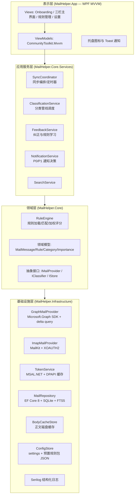
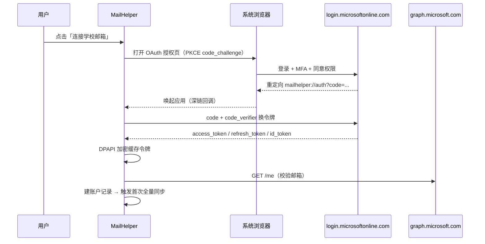
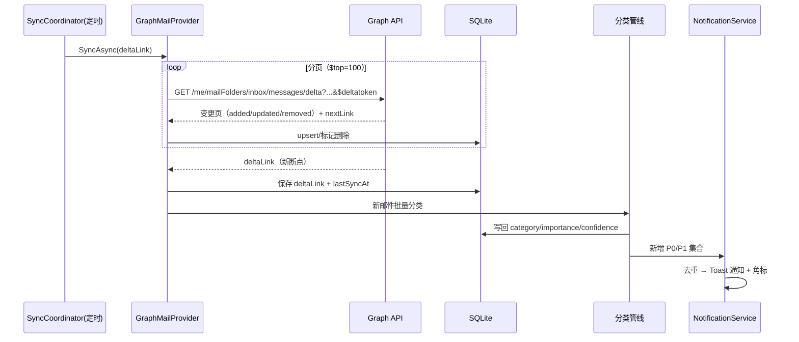
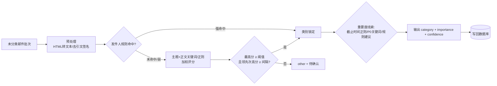
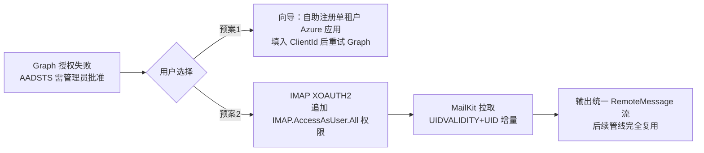

# 03 系统架构设计说明书

| 文档编号 | MH-HLD-03 | 版本 | v1.0 |
| --- | --- | --- | --- |
| 作者 | 技术负责人 | 状态 | 待评审 |
| 创建日期 | 2026-09-26 | 上游文档 | [02 需求规格说明书](02-需求规格说明书.md) |
| 评审记录 | 无（首次提交） | 下游文档 | [04 详细设计说明书](04-详细设计说明书.md) |

---

## 1. 架构目标与约束

| 目标 | 对应需求 | 架构策略 |
| --- | --- | --- |
| 实现简单、便于维护（**第一原则**） | NFR-10 | 分层清晰、依赖单向向下；分类/同步核心与 UI 完全解耦；规则外置 JSON |
| 数据本地化 | CON-02、NFR-07 | 无任何自建服务端；直连微软端点；本地 SQLite + 磁盘缓存 |
| 后台可持续同步 | FR-04/14 | 进程内定时器 + 托盘常驻，不引入 Windows 服务（降低安装/权限复杂度） |
| 分类可演进 | FR-07/10/11 | `IClassifier` 扩展点 + 规则引擎为默认实现，LLM/ML 后插不改编译期依赖 |
| 应对租户授权差异 | FR-02、EX-01 | 邮件接入抽象为 `IMailProvider`，Graph 与 IMAP 双实现可切换 |

## 2. 总体架构

### 2.1 分层架构图



**依赖规则**：只能上层依赖下层；领域层不引用任何具体 SDK（Graph/MailKit 只出现在基础设施层），保证核心逻辑可单测。

### 2.2 进程与运行形态

- 单进程 WPF 应用，单实例互斥（命名 Mutex）。
- 主窗口关闭 ≠ 退出：隐藏至托盘，`PeriodicTimer` 后台循环继续同步。
- 完全退出：托盘菜单「退出」，停止定时器并落盘状态。

## 3. 技术选型

### 3.1 候选对比

| 维度 | **C# .NET 8 + WPF（选定）** | Electron + Vue3 | Tauri 2 + React | Python + PyQt6 |
| --- | --- | --- | --- | --- |
| Windows 原生体验 | ★★★ 系统托盘/通知/自启动原生支持 | ★★ 需桥接 | ★★ 需桥接 | ★★ |
| 微软生态支持（MSAL/Graph SDK） | ★★★ 官方一等 SDK | ★★ 需自行封装 REST/OAuth | ★★ 同左 | ★★ MSAL.Python 可用 |
| 安装包体积 | ★★ ~70–100MB（自包含单文件） | ★ ~150MB+ | ★★★ ~10MB | ★★ ~50MB（PyInstaller 脆弱） |
| 内存占用 | ★★ ~100–200MB | ★ 200MB+ | ★★★ 低 | ★★ |
| 开发效率 | ★★★ 强类型 + EF Core + LINQ | ★★★ 前端生态 | ★★ 需 Rust | ★★★ 原型快 |
| 打包为 exe 与自动更新 | ★★★ `dotnet publish` 单文件 + Velopack | ★★ electron-builder | ★★★ 内置 | ★ PyInstaller 易碎、更新方案弱 |
| 维护成本（关键） | ★★★ 单语言、官方长期支持（LTS） | ★★ 双栈（JS+Node） | ★★ 引入 Rust 技能要求 | ★★ 打包与依赖漂移是长期坑 |

**结论**：与微软云服务的亲和度 + 单语言维护成本 + exe 发布成熟度，WPF 方案全面占优（详见 ADR-001）。

### 3.2 架构决策记录（ADR）

#### ADR-001 桌面框架采用 .NET 8 + WPF，而非 Electron/Tauri/PyQt

- **背景**：目标为 Windows 单文件 exe，核心复杂度在「微软云接入 + 后台同步 + 数据本地处理」，UI 复杂度中等（三栏布局）。
- **决策**：.NET 8（LTS）+ WPF + MVVM（CommunityToolkit.Mvvm）。
- **理由**：MSAL.NET 与 Microsoft.Graph SDK 官方维护；WPF `ListView` 虚拟化天然支撑万级列表（NFR-02）；单一技术栈单人可维护；.NET 8 为 LTS 支持至 2026-11 后有 .NET 9/10 平滑升级路径。
- **代价**：UI 开发效率低于 Web 技术栈；仅 Windows（符合范围）。

#### ADR-002 邮件接入以 Graph delta query 轮询为主，IMAP 兜底；不使用 Webhook

- **背景**：需要近实时感知新邮件。Graph change notifications 需要**公网可达的回调端点**，桌面客户端不具备；本产品明确无服务器。
- **决策**：客户端定时（默认 5 分钟）调用 `/messages/delta` 增量拉取；`deltaLink` 持久化。个别租户封锁第三方 Graph 同意时切换 IMAP XOAUTH2。
- **理由**：零服务器、官方增量语义、断点续传；5 分钟粒度对本场景足够（邮件非即时通讯）。
- **代价**：最长 1 个周期延迟；通过手动同步按钮（FR-06）弥补。

#### ADR-003 本地存储采用 SQLite（EF Core 8）+ 正文磁盘缓存 + FTS5

- **背景**：万级邮件元数据检索、全文搜索、零部署。
- **决策**：单 SQLite 库存元数据；HTML 正文写 `%AppData%\MailHelper\bodies\` 磁盘缓存（数据库不膨胀）；FTS5 虚表支持全文搜索。
- **理由**：零安装、单文件易备份；EF Core 降低 SQL 维护成本；FTS5 满足 NFR-03。
- **代价**：EF Core 对 FTS5 需少量原生 SQL（隔离在 Repository 内）。

#### ADR-004 分类采用「规则引擎优先 + IClassifier 扩展点」，暂不引入 LLM/ML

- **背景**：港校邮件来源规律性强，规则可解释、零成本、离线可用；LLM 有隐私出域与成本问题（09 §7）。
- **决策**：v1.0 仅内置规则引擎；定义 `IClassifier` 接口与分类管线，LLM/本地 ML 作为后续插件实现。
- **理由**：冷启动即有 ≥85% 目标准确率；用户可完全离线；维护成本最低。
- **代价**：规则盲区长尾邮件落入「其他/待确认」，由 FR-09/11 队列与反馈闭环消化。

## 4. 模块划分

| 模块 | 编号 | 职责 | 关键类型（示意） |
| --- | --- | --- | --- |
| 客户端 UI | MOD-01 | 视图/视图模型/导航/主题/托盘 | `ShellWindow`, `InboxViewModel`, `TrayIconViewModel` |
| 同步编排 | MOD-02 | 定时触发、全量/增量流程、限流退避、状态机（Idle/Syncing/Offline/Error） | `SyncCoordinator`, `SyncState` |
| 邮件接入 | MOD-03 | Graph/IMAP 双实现，统一输出 `RemoteMessage` 流与 deltaLink | `GraphMailProvider`, `ImapMailProvider`, `IMailProvider` |
| 认证令牌 | MOD-04 | MSAL 交互/静默获取、DPAPI 缓存、账户生命周期 | `TokenService` |
| 分类引擎 | MOD-05 | 规则加载、管线执行、评分与阈值、置信度 | `RuleEngine`, `ClassificationPipeline`, `RuleSet` |
| 反馈学习 | MOD-06 | 记录改判、半自动生成/加权发件人规则 | `FeedbackService` |
| 通知 | MOD-07 | P0/P1 通知决策、去重、勿扰、角标 | `NotificationService` |
| 存储访问 | MOD-08 | 仓储、FTS、正文缓存、迁移 | `MailRepository`, `BodyCacheStore` |
| 检索 | MOD-09 | 搜索语法解析、FTS 查询 | `SearchService` |
| 配置 | MOD-10 | 用户设置、预置规则包版本管理 | `ConfigStore` |

## 5. 关键流程

### 5.1 首次授权（UC-01）



### 5.2 增量同步（UC-02）



### 5.3 分类管线（UC-03）



**评分模型（v1 简化加权）**：

```
score(category) = Σ (rule.weight)         rule ∈ 命中该类别的规则
confidence      = f(top1, top2)           依分差归一化到 [0,1]
规则权重基准：发件人精确=10，域名=8，主题正则=6，主题关键词=3，
启用中的用户自定义规则 ×1.2，用户反馈生成规则 ×1.5（上限截断）
阈值：top1 ≥ 3 且 (top1 − top2) ≥ 2 才接受，否则 other/待确认
```

权重与阈值集中在外置 JSON（`rules.builtin.json` / `rules.user.json`），可随版本迭代调参，无需改代码（NFR-10）。

### 5.4 IMAP 兜底通道（FR-02，EX-01 触发）



IMAP 增量语义基于 `UID`（记录每文件夹最高 UID 与 UIDVALIDITY），不支持远端删除感知（v1.0 可接受：本地仅新增）。

## 6. 数据架构

- **权威源**：微软云端邮箱；**本地为只读缓存 + 派生标注**（category/importance 为本地派生数据，远端不回写）。
- `messages` 表为核心事实表；`rules`、`classification_feedback` 为派生知识；`accounts.sync_delta_link` 为同步断点。
- 正文 HTML 落磁盘：`%AppData%\MailHelper\bodies\{accountId}\{sha1(html)}.html`，LRU 上限（默认 2GB，可配置）。

## 7. 质量属性设计

| 属性 | 设计落实 |
| --- | --- |
| 性能（NFR-01/02/04） | 启动延迟加载（主窗口先渲染，同步服务后台初始化）；`ListView` + `VirtualizingPanel`；同步批处理 100/页、批量 upsert 事务 |
| 可靠性（NFR-05） | deltaLink 断点续传；EF 迁移 + 库损坏检测重建（EX-07）；Serilog 滚动文件 + 全局异常兜底（崩溃写 dump 与日志） |
| 安全（NFR-06） | 令牌 DPAPI；WebView2 禁脚本渲染；日志脱敏（主题截断、不发正文）；见 09 |
| 可维护性（NFR-10） | 四层单向依赖；规则 JSON 外置；`IMailProvider`/`IClassifier`/`IStore` 三大扩展点；核心工程 `MailHelper.Core` 无 UI 依赖可单测 |
| 可部署性（NFR-11） | 自包含单文件 publish；WebView2 引导安装；Velopack 增量更新 |

## 8. 演进路线（架构预留）

| 阶段 | 演进 | 架构支撑 |
| --- | --- | --- |
| V1.1 | LLM 分类插件（用户自备 Key，显式同意） | `IClassifier` 注册为第二级分类器，仅对「待确认」邮件调用 |
| V1.2 | 多账户 | `accounts` 多行天然支持；UI 侧边栏账户切换 |
| V2.0 | 远端写操作（归档/移动） | `IMailProvider` 增加写方法；先做幂等与撤销 |
| V2.0+ | 聚合摘要日报 | 基于本地 `messages` 派生，无新依赖 |
