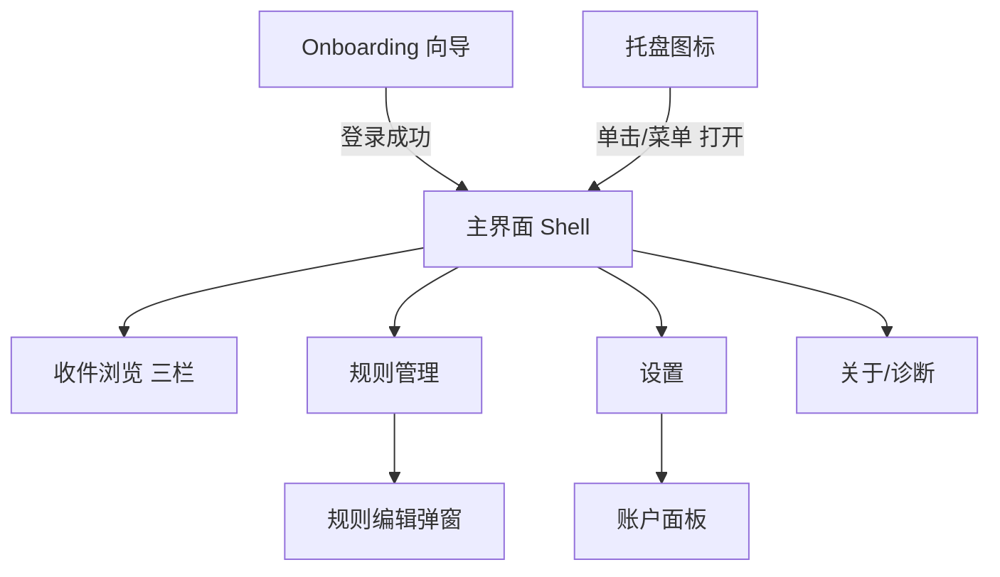
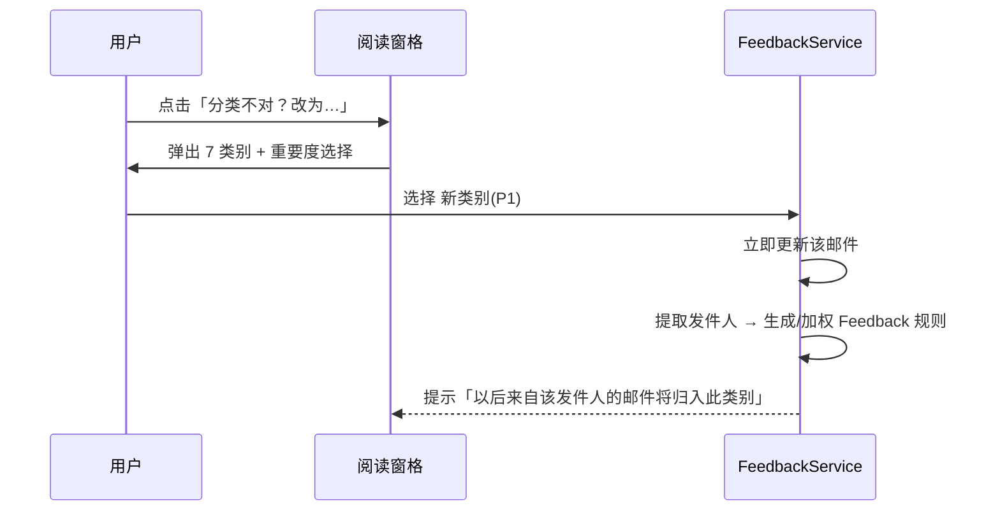
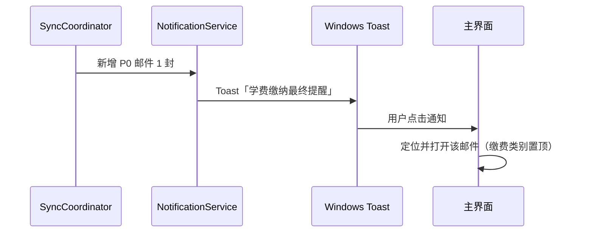

# 05 UI-UX 设计说明

| 文档编号 | MH-UIUX-05 | 版本 | v1.0 |
| --- | --- | --- | --- |
| 作者 | 开发/设计 | 状态 | 待评审 |
| 创建日期 | 2026-09-26 | 上游文档 | [02 需求规格说明书](02-需求规格说明书.md) |
| 评审记录 | 无（首次提交） | 关联 | 04 详细设计（界面即 04 §1 的 `MailHelper.App`） |

---

## 1. 设计原则

1. **10 秒法则**：打开软件 → 看到「今天必须处理的事」，路径 ≤ 1 次点击。
2. **一眼可辨**：重要度用颜色徽章表达，不依赖文字；P0 永远最醒目。
3. **零配置可用**：默认即预置规则包 + 合理排序，高级能力（规则编辑器）藏在二级页。
4. **安静**：除 P0/P1 外不打扰；空态、离线、同步中均需有明确但不焦虑的表达。

## 2. 信息架构与导航



页面清单：Onboarding 向导、主界面（三栏）、规则管理、规则编辑（对话框）、设置、关于。共 5 页 + 2 对话框，导航层级 ≤ 2。

## 3. 关键界面线框（低保真）

### 3.1 Onboarding 向导（UC-01）

```
┌──────────────────────────────────────────────┐
│                                              │
│                 [产品 Logo]                  │
│            MailHelper 邮箱管家               │
│   让港校邮箱里的大事小事，各归其位          │
│                                              │
│   ①  连接你的学校邮箱（约 1 分钟）           │
│      支持各港校 Office 365 学生邮箱          │
│                                              │
│         [ 连接学校邮箱 ]  ← 主按钮           │
│    遇到「需要管理员批准」？查看帮助 →        │
│                                              │
│   □ 同意《隐私说明》（本地存储，不出本机）  │
│                                              │
└──────────────────────────────────────────────┘
步骤2：系统浏览器完成微软登录 → 自动返回
步骤3：进度页「正在同步你的收件箱 328/1200」+ 取消
```

要点：登录前必须勾选隐私说明（PDPO 合规，见 09 §6）；「管理员批准」文案直接给出预案入口（EX-01）。

### 3.2 主界面（三栏，UC-04）

```
┌────────────────────────────────────────────────────────────────────────────┐
│ MailHelper   [🔍 搜索邮件、发件人…                    ]   账户▾  ⚙  ─ □ ✕ │
├──────────────┬─────────────────────────────────┬───────────────────────────┤
│ 收件箱(128)  │ 筛选: [重要度▾] [未读☑] [排序▾] │  From: 财务处 finance@…   │
│ ⏰ 待确认(6) │ ┌─────────────────────────────┐ │  09:12 · P0 · 财务缴费    │
│──────────────│ │🔴P0 📄 财务处  09:12        │ │ ─────────────────────── │
│ 📚 课程 (32) │ │ 学费缴纳最终提醒 - 9月30日… │ │  ⚠ P0 紧急                │
│ 💼 职业 (11) │ ├─────────────────────────────┤ │                           │
│ 🏫 事务 (18) │ │🟠P1 💼 Careers  昨天         │ │  学费缴纳最终提醒          │
│ 💰 缴费 (3)  │ │ 面试邀约:XX银行暑期实习     │ │  你的学费 HK$xx,xxx 须于   │
│ 📢 公告 (27) │ ├─────────────────────────────┤ │  2026-09-30 前缴清…       │
│ 📨 订阅 (99) │ │🟠P1 📚 Moodle  昨天          │ │                           │
│ 🗂 其他 (14) │ │ 作业2成绩已公布             │ │  [在 Outlook 中打开]      │
│──────────────│ ├─────────────────────────────┤ │                           │
│ 今日 P0/P1(5)│ │🔵P2 🏫 注册处  周三          │ │  分类不对？ [改为 ▾]      │
│──────────────│ │ 秋季注册确认通知             │ │                           │
│ ⚙ 设置       │ └─────────────────────────────┘ │  附件: invoice.pdf (只读) │
├──────────────┴─────────────────────────────────┴───────────────────────────┤
│ ● 上次同步 09:15 · 5 分钟后自动同步    [⟳ 立即同步]                        │
└────────────────────────────────────────────────────────────────────────────┘
```

交互要点：
- 左栏固定显示 7 类别 + 未读计数；「待确认」为 FR-09 队列入口，红点提示。
- 中栏默认排序：`importance DESC → received_at DESC`；行内徽章见 §5 色卡。
- 右栏阅读窗格：WebView2 沙箱（禁脚本）；「改为 ▾」即 UC-06 纠正入口（顺手原则，纠正成本 2 次点击）。
- 底部状态栏常显同步状态与离线提示（US-11）。

### 3.3 规则管理（UC-07）

```
┌─ 分类规则 ──────────────────────────────────────────────┐
│ [+ 新建规则]   [从选中邮件创建…]                          │
│ ┌─筛选: [全部|内置|自定义|反馈生成]──────────────────┐  │
│ │ 名称            类型        模式            类别  权重 开 │  │
│ │ Moodle-HKU      发件人域名  moodle.hku.hk   课程  8  ✓ │  │
│ │ P0-Deadline     主题正则    final reminder… —P0   6  ✓ │  │
│ │ (反馈) dean@…   发件人      dean@ust.hk     事务  9  ✓ │  │
│ └────────────────────────────────────────────────────┘  │
│ [试跑预览：对最近 100 封邮件查看命中结果]                │
└──────────────────────────────────────────────────────────┘
```

内置规则可禁用不可删除；反馈生成规则带来源标签，可删除（撤销学习）。

### 3.4 设置页

分组：**账户**（邮箱、通道 Graph/IMAP、上次同步、登出、清除本地数据）/ **同步**（间隔、启动即同步）/ **通知**（P0/P1 开关、勿扰时段）/ **外观**（语言、主题）/ **高级**（缓存上限、日志诊断模式、导出/导入规则、清理已删记录）。

### 3.5 托盘

```
 [托盘图标(带角标 3)]
   ├─ 打开 MailHelper
   ├─ 立即同步
   ├─ 通知: P0 ✓ / P1 ✓
   ├─ 设置…
   └─ 退出
```

图标状态语义：正常（蓝）/ 同步中（旋转动画）/ 离线（灰）/ 需重新登录（黄感叹）。

## 4. 关键交互流程

### 4.1 纠正分类（UC-06）



### 4.2 P0 通知 → 处理闭环



## 5. 视觉规范

### 5.1 重要度色卡（核心视觉资产）

| 级别 | 颜色 | 色值（浅色主题） | 用法 |
| --- | --- | --- | --- |
| P0 紧急 | 红 | `#D13438` | 列表左缘 3px 色条 + 实心圆点徽章；阅读窗格顶部警示条 |
| P1 重要 | 橙 | `#F7630C` | 色条 + 徽章 |
| P2 普通 | 蓝 | `#0078D4` | 徽章 |
| P3 低 | 灰 | `#8A8886` | 徽章 |

深色主题按 Fluent 深色板同比例提亮（P0 `#FF5C5C` 等）。

### 5.2 类别图标（Segoe Fluent Icons 语义近似）

| 类别 | 图标 | 类别 | 图标 |
| --- | --- | --- | --- |
| 课程学习 | 📚 Book | 财务缴费 | 💰 Money |
| 职业发展 | 💼 Briefcase | 通知公告 | 📢 Megaphone |
| 校园事务 | 🏫 Building | 订阅营销 | 📨 Inbox/低饱和 |
| 其他 | 🗂 Folder | | |

### 5.3 字体与布局

- 字体：界面 Segoe UI / 微软雅黑（zh-CN）；阅读窗格邮件正文用邮件自带样式（WebView2 内，不干预字体）。
- 基准字号 14px，行内徽章 12px；行高：列表行 52px（两行：主题 + 发件人·时间）。
- 间距体系 4/8/12/16/24；三栏默认宽度 220 / 弹性 / 40%，均可拖拽，布局持久化。

## 6. 状态设计（四态全覆盖）

| 状态 | 表现 |
| --- | --- |
| 空态 | 类别空：「该分类暂无邮件」+ 跳转「全部」；首次同步中：进度条 + 说明 |
| 加载态 | 列表骨架屏（shimmer）；阅读窗格单封加载：内容占位符 |
| 错误态 | 同步失败：状态栏红点 + 悬停显示错误码与「重试」；需重登录：顶部横幅「请重新登录」 |
| 离线态 | 状态栏「离线 · 上次同步 09:15」；列表照常可浏览（本地缓存价值） |

## 7. 国际化与无障碍

- 资源文件 `Strings.zh-CN.xaml` / `Strings.en.xaml`，所有文案不硬编码（NFR-12）。
- 对比度：正文与背景 ≥ 4.5:1；P0 红 vs 白背景 ≥ 4.5:1。
- 键盘：`↑/↓` 列表导航、`Enter` 打开、`Ctrl+F` 搜索、`Ctrl+R` 立即同步；焦点顺序合理，全部控件可 Tab 达。
- 屏幕阅读器：徽章附 AutomationProperties.Name（「紧急 P0」而非仅色点）。
- 高 DPI：全矢量图标（字体图标 + Path），100%–200% 无锯齿。

## 8. 可用性验收（对接 NFR-09 / 06 §8）

| 任务 | 成功标准 |
| --- | --- |
| T1 新用户完成连接并看到分类结果 | ≤ 3 分钟，无文档协助，成功率 ≥ 90% |
| T2 找到「学费缴费截止」邮件 | ≤ 30 秒（对比在 Outlook 网页版 ≤ 2 分钟） |
| T3 纠正一封误分类邮件 | ≤ 15 秒，且下次同发件人邮件不再误分 |
| T4 关闭窗口后仍能收到 P0 通知 | 托盘存在 + 通知可达 |
