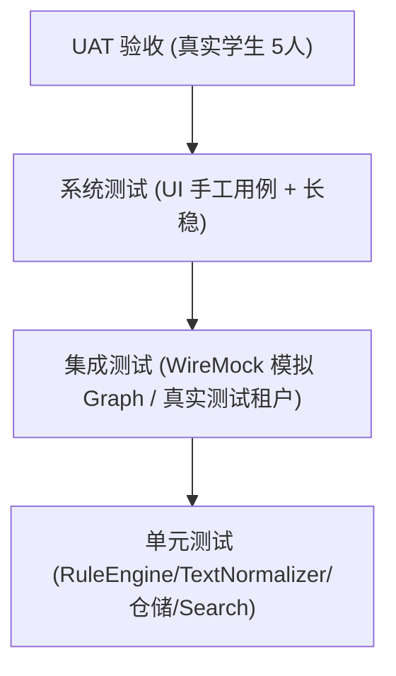

# 06 测试计划

| 文档编号 | MH-TEST-06 | 版本 | v1.0 |
| --- | --- | --- | --- |
| 作者 | 测试/开发 | 状态 | 待评审 |
| 创建日期 | 2026-09-26 | 上游文档 | [02 需求规格说明书](02-需求规格说明书.md) |
| 评审记录 | 无（首次提交） | 关联 | 04 详细设计（用例实现依据） |

---

## 1. 测试目标与范围

**目标**：验证 v1.0 满足 02 章全部 M/S 级需求及 NFR，重点保障：① P0 邮件不漏不滥；② 同步可靠与断点续传；③ 本地数据与令牌安全。

**范围**：单元、集成、系统、性能、安全、UAT。**不在范围**：微软服务端自身缺陷、非 Windows 平台。

## 2. 测试环境与数据

| 环境 | 配置 | 用途 |
| --- | --- | --- |
| DEV | Win11 x64 / .NET 8 / 本地 SQLite | 单元 + 集成（WireMock 模拟 Graph） |
| TEST-LOW | Win10 19041 / 8GB RAM / 机械盘下限 | 最低配置兼容 |
| TEST-STD | Win11 / 16GB / SSD / 200Mbps | 性能基准（NFR 度量基准机） |
| UAT | 3–5 名真实港校学生 + 其真实邮箱（脱敏约定） | 验收 |

**测试账号**：项目自有测试租户账号 ×2（Graph 通道、IMAP 通道各一）；**禁止**在自动化中操作真实学生邮箱（09 §4）。

**分类器样本集（核心资产）**：
- 规模 ≥ 600 封，覆盖 7 类别 × P0–P3，中英文混合，来源：公开样例邮件改写 + 项目自有测试邮箱真实邮件（脱敏）。
- 每封标注：`category, importance, sender, subject, body(.eml)`，存放 `tests/fixtures/sample-corpus/`（.eml + labels.csv）。
- 划分：训练/调参 60%（预置规则包调优），评估 40%（只测不改，防过拟合）。

## 3. 测试策略（金字塔）

- 单元测试框架：xUnit + FluentAssertions；覆盖率工具：coverlet（核心工程行覆盖 ≥ 80%，NFR-10）。
- 集成：WireMock.NET 按 04 §4.1 契约模拟 delta 分页/429/401/deltaLink 失效；真实租户用例每日定时跑（检测 Graph 契约漂移）。
- 系统测试：手工用例（本计划 §5）+ 72h 长稳（NFR-05）。
- 回归：每次合并到 main 触发全量单元 + 集成（08 §4 CI）。

## 4. 分类器评估（FR-07/08 核心验收）

### 4.1 指标与达标线

| 指标 | 定义 | 达标线 |
| --- | --- | --- |
| 类别准确率 | 评估集上 category 正确比例 | ≥ 85% |
| P0 召回率 | 真实 P0 被判为 P0 的比例 | ≥ 95% |
| P0 误报率 | 被判 P0 但真实 ≤ P1 的比例 | ≤ 10% |
| 待确认率 | 落入「待确认」队列比例 | 15%–30%（越低越好，上限防滥用） |

### 4.2 评估流程

1. CI 中每日对评估集跑 `RuleEngine` 批量分类 → 输出混淆矩阵报告（HTML artifact）。
2. 预置规则包改动（`rules.builtin.json`）必须附评估报告，任一指标回退 > 2 个百分点则评审。
3. 边界专项：仅主题触发 P0、正文才含截止时间的邮件、无主题邮件、全大写/表情符号主题、转发链内嵌截止时间。

### 4.3 鲁棒性用例（节选）

| 编号 | 输入 | 期望 |
| --- | --- | --- |
| R-01 | `Subject: FINAL REMINDER: Tuition Fee Payment` | finance + P0 |
| R-02 | `Subject: 面试邀约 Interview Invitation - Summer Intern` | career + P1 |
| R-03 | Moodle 课件更新通知 | course + P2 |
| R-04 | 社团 newsletter（含 unsubscribe） | subscription + P3 |
| R-05 | 未知发件人无关键词 | other + 待确认（confidence < 阈值） |
| R-06 | 正常通知但正文含「deadline」字样在引文深处 | 不得仅因引文判 P0（预处理剥离验证） |
| R-07 | 恶意超长正则主题（ReDoS 探针） | 规则超时被跳过，进程不卡死（CLASS-001） |

## 5. 功能测试用例（系统测试，映射 FR）

> 完整用例库在测试管理工具维护，此处为关键用例；每条含前置/步骤/预期。

| TC | 需求 | 用例 | 预期 |
| --- | --- | --- | --- |
| TC-001 | FR-01 | 测试租户账号走完登录（含 MFA） | 60s 内完成；账户页显示邮箱；重启动免登录 |
| TC-002 | FR-01 | 登录中点取消 | 回引导页；无残留令牌 |
| TC-003 | FR-01 | 登出后检查 `%AppData%\MailHelper\tokens` | 缓存清除；本地邮件仍可浏览（可选保留） |
| TC-004 | FR-02 | 模拟租户拒绝同意（WireMock 返回 AADSTS65001） | 出现「管理员批准」指引与 IMAP 兜底入口 |
| TC-005 | FR-02 | IMAP 通道完成首次同步 | 收件箱邮件入库并正常分类 |
| TC-006 | FR-04 | 远端新增 1 封邮件 | ≤1 周期出现在列表且已分类 |
| TC-007 | FR-04 | 远端删除 1 封邮件 | 本地标记已删，默认视图隐藏 |
| TC-008 | FR-04 | 重复同步同批次（deltaLink 重放） | 无重复记录（主键幂等） |
| TC-009 | FR-05 | 5000 封存量全量同步 | ≤2min；进度可见；中途取消后可续 |
| TC-010 | FR-07 | 导入 600 封样本集跑分类 | 类别准确率 ≥85%（混淆矩阵） |
| TC-011 | FR-08 | P0 样本子集 | 召回 ≥95%、误报 ≤10% |
| TC-012 | FR-09 | 构造两类别分差 < 阈值邮件 | 进入「待确认」；侧栏计数正确 |
| TC-013 | FR-10 | 新建主题关键词规则 → 试跑预览 → 保存 | 命中列表正确；新邮件按新规则分类 |
| TC-014 | FR-11 | 改判 1 封 → 再收同发件人新邮件 | 新邮件直接归新类别（反馈规则生效） |
| TC-015 | FR-12 | 万级列表滚动 + 三栏拖拽 | 流畅（NFR-02）；布局记忆 |
| TC-016 | FR-12 | 打开含脚本的 HTML 邮件（安全样例） | 脚本不执行；外链点击前有确认（09 §5） |
| TC-017 | FR-13 | 搜索中英文关键词 | <500ms；结果与 FTS 预期一致 |
| TC-018 | FR-14 | 注入 1 封 P0 + 3 封 P1 新邮件 | P0 逐封 Toast、P1 聚合；点击直达；无重复通知 |
| TC-019 | FR-14 | 关闭主窗口 | 进程驻留托盘；下轮同步照常 |
| TC-020 | FR-03/US-10 | 开机自启开/关 | 注册表 Run 键同步变化 |

## 6. 异常流与边界测试（对应 02 §8）

| TC | 场景（复用 WireMock 故障注入） | 预期行为 |
| --- | --- | --- |
| EX-TC-01 | Graph 持续 429 | 退避 3 次后状态「同步受限」；恢复后自动追平 |
| EX-TC-02 | 中途 401 | 静默刷新成功续传；拒绝刷新则 ReauthRequired |
| EX-TC-03 | deltaLink 失效（410） | 自动全量重同步且无重复 |
| EX-TC-04 | 断网 10 分钟 | 状态「离线」；恢复后自动同步；UI 可浏览 |
| EX-TC-05 | 同步中强杀进程 | 重启后按 deltaLink 续传；库无脏数据（WAL） |
| EX-TC-06 | SQLite 手工破坏后启动 | 重建提示；规则/设置保留 |
| EX-TC-07 | 双击第二次启动 | 唤起既有窗口，不出现双实例 |
| EX-TC-08 | >5MB 正文 / 缺失编码邮件 | 预览截断入库；批次不中断 |

## 7. 性能测试（NFR-01/02/03/04）

| 编号 | 场景 | 达标 | 方法 |
| --- | --- | --- | --- |
| PERF-01 | 冷启动（杀进程后启动至列表可交互） | ≤ 3s（TEST-STD，5 次中位） | 埋点计时 |
| PERF-02 | 10,000 行列表连续滚动 60s | 无卡顿感知，帧时间 P95 < 22ms | PresentMon/计时 |
| PERF-03 | 万级数据搜索 20 组关键词 | P95 < 500ms | API 计时 |
| PERF-04 | 全量 5000 封（200Mbps） | ≤ 2min；批量入库批 100/事务 | 计时 + 日志 |
| PERF-05 | 单封新邮件入库+分类 | ≤ 1s | 计时 |
| PERF-06 | 72h 长稳（间隔 5min） | 无内存泄漏（增量 <10%）、崩溃 0 | 长稳脚本 + 内存曲线 |
| PERF-07 | 资源占用 | 空闲驻留内存 ≤ 250MB；同步外 CPU ≈ 0 | 任务管理器采样 |

## 8. 安全测试清单（对接 09）

| 编号 | 检查 | 方法 |
| --- | --- | --- |
| SEC-01 | 令牌缓存文件加密（DPAPI）且非本机用户不可解 | 拷贝缓存到第二台机器验证不可用 |
| SEC-02 | 日志无正文/令牌泄漏 | 遍历日志文件 grep 主题全文、token 片段 |
| SEC-03 | WebView2 禁脚本/禁弹窗/外链确认 | 注入样例邮件（XSS 探针）执行 TC-016 |
| SEC-04 | FTS/规则输入无 SQL 注入面 | 参数化抽查 + 恶意关键词 |
| SEC-05 | 安装目录/配置文件 ACL 仅当前用户可写 | icacls 审查 |
| SEC-06 | 卸载清除 `%AppData%\MailHelper`（可选保留需用户确认） | 卸载后目录检查 |

## 9. UAT 与发布门禁

**UAT**（5 名学生 × 2 周）：每日真实使用；任务 T1–T4（05 §8）计时；收集分类纠正率（待确认+改判占比 < 25%）；满意度 ≥ 4/5。

**发布门禁（全绿方可 Release）**：

| # | 门禁项 | 标准 |
| --- | --- | --- |
| G1 | 单元 + 集成测试 | 100% 通过，核心覆盖 ≥ 80% |
| G2 | 分类器评估 | FR-07/08 指标达标（§4.1） |
| G3 | 系统测试 | M 级 FR 用例 100% 通过，S 级 ≥ 90% |
| G4 | 性能 | PERF-01~05 达标 |
| G5 | 安全 | SEC-01~06 全过 |
| G6 | 缺陷 | 无 P0/P1 级未关闭缺陷（P2 带 issue 可豁免，需评审） |
| G7 | UAT | T1–T4 成功率 ≥ 90%，无阻塞性反馈 |

## 10. 缺陷管理

- 等级：P0 崩溃/数据丢失/安全 → 当日修复；P1 核心功能不可用 → 当前迭代；P2 一般 → 排期；P3 体验 → backlog。
- 流转：Open → In Progress → Fixed →（测试复验）→ Closed；发布前 P0/P1 清零（G6）。
