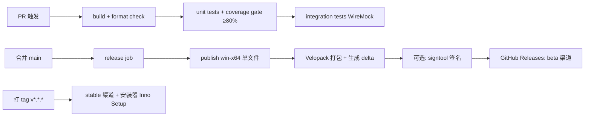

# 08 构建发布与运维手册

| 文档编号 | MH-OPS-08 | 版本 | v1.0 |
| --- | --- | --- | --- |
| 作者 | 开发/运维 | 状态 | 待评审 |
| 创建日期 | 2026-09-26 | 上游文档 | [07 项目计划](07-项目计划与风险管理.md) |
| 评审记录 | 无（首次提交） | 关联 | 04 详细设计（工程布局）、09 安全与合规 |

---

## 1. 源码管理与协作

### 1.1 分支策略（适配 1–2 人小团队，GitHub Flow 简化版）

| 分支 | 用途 | 规则 |
| --- | --- | --- |
| `main` | 可发布基线 | 受保护：PR + CI 全绿方可合并；合并即产生 beta 渠道产物 |
| `feature/<fr-id>-<slug>` | 功能开发 | 例 `feature/fr08-importance`；小步提交，Squash 合并 |
| `hotfix/<version>` | 紧急修复 | 从 tag 拉出，修复合回 main |

### 1.2 提交规范（Conventional Commits）

```
<type>(<scope>): <subject>          例：
feat(classifier): P0 截止时间正则命中正文引用前内容
fix(sync): deltaLink 失效后自动全量重同步 (#SYNC-003)
docs(spec): 更新风险登记册 RISK-06
type ∈ feat|fix|docs|test|refactor|build|chore
```

### 1.3 版本号（SemVer）

`MAJOR.MINOR.PATCH`——规则包（`rules.builtin.json`）独立版本号 `YYYY.MM`，随版本表管理（04 §7）。

## 2. 本地构建

```bash
# 还原 & 构建
dotnet restore
dotnet build -c Release

# 单元 + 集成测试（WireMock，不出网）
dotnet test tests/... -c Release --collect:"XPlat Code Coverage"

# 本地发布包（自包含单文件，见 §5.1）
dotnet publish src/MailHelper.App -c Release -r win-x64 `
  -p:PublishSingleFile=true -p:SelfContained=true `
  -p:IncludeNativeLibrariesForSelfExtract=true
```

## 3. CI/CD（GitHub Actions）

### 3.1 流水线总览



### 3.2 关键 workflow 片段（`.github/workflows/ci.yml` 摘要）

```yaml
jobs:
  build-test:
    runs-on: windows-latest
    steps:
      - uses: actions/checkout@v4
      - uses: actions/setup-dotnet@v4
        with: { dotnet-version: '8.0.x' }
      - run: dotnet build -c Release
      - run: dotnet test -c Release --collect:"XPlat Code Coverage"
      # 覆盖率门禁（阈值 80%，见 06 §3）
      - run: |
          dotnet tool install -g dotnet-reportgenerator-globaltool
          reportgenerator -reports:**/coverage.cobertura.xml -reporttypes:TextSummary
          # 解析并在 <80% 时 exit 1

  release:
    needs: build-test
    if: github.ref == 'refs/heads/main'
    steps:
      - run: dotnet publish src/MailHelper.App -c Release -r win-x64
              -p:PublishSingleFile=true -p:SelfContained=true
      - run: |
          vpk pack --packId MailHelper --packVersion ${{ github.run_number }}
                   --packDirectory publish --mainExe MailHelper.exe
      - run: vpk publish --channel beta --gitHubRepo ${{ github.repository }}
```

**密钥管理**：签名证书与任何令牌只存 GitHub Actions Secrets / 本机用户证书库，绝不入库（09 §4）。

## 4. 打包与分发

### 4.1 两种产物

| 产物 | 说明 | 适用 |
| --- | --- | --- |
| 便携版单文件 `MailHelper.exe` | 自包含 .NET 运行时，解压即用 | 进阶用户、免安装场景 |
| 安装包 `MailHelperSetup.exe`（Inno Setup） | 默认装 `%LocalAppData%\Programs\MailHelper`；内置 WebView2 引导；创建快捷方式与卸载项 | 主推，多数用户 |

### 4.2 WebView2 引导（RISK-04 缓解）

Inno Setup 脚本检测 `HKEY_LOCAL_MACHINE\SOFTWARE\WOW6432Node\Microsoft\EdgeUpdate\Clients\{F3017226-FE2A-4295-8BDF-00C3A9A7E4C5}`；不存在则静默执行 `MicrosoftEdgeWebview2Setup.exe /silent /install`（随安装包携带，约 120MB 或在线引导）。

### 4.3 自动更新（Velopack）

- 启动后检查更新（beta/stable 双通道），后台下载 delta 包，退出时应用。
- 更新失败静默回退当前版本，下轮重试；日志记录 `update.applied/failed`。

### 4.4 代码签名（RISK-07）

- 首选：个人开发者 OV 证书（Azure Trusted Signing 或 SSL.com 等，年度约数十至数百美元）对 exe 与安装包签名。
- 无证书发布：README 与发布页显著位置提供 SHA256 校验值与 SmartScreen「更多信息 → 仍要运行」图文指引。

## 5. 发布检查单（Release Checklist）

| # | 项 | 负责人 |
| --- | --- | --- |
| 1 | 06 §9 门禁 G1–G7 全绿 | 测试 |
| 2 | 版本号已按 SemVer 提升（含规则包版本） | 开发 |
| 3 | `CHANGELOG.md` 已更新（用户可读文案） | 开发 |
| 4 | 预置规则包已跑评估流水线且指标达标 | 开发 |
| 5 | 安装包/便携版本地全流程验证：全新安装、升级安装、卸载 | 测试 |
| 6 | 签名/校验哈希已发布 | 开发 |
| 7 | Release 页面：产物 + 已知问题 + 回滚说明 | PM |
| 8 | 更新通道切换（beta→stable）并验证 velopack 元数据 | 开发 |

## 6. 运维（桌面单机版轻量运维）

### 6.1 用户侧数据与日志位置

| 内容 | 路径 |
| --- | --- |
| 数据库与配置 | `%AppData%\MailHelper\mailhelper.db`、`*.json` |
| 正文缓存 | `%AppData%\MailHelper\bodies\` |
| 日志 | `%AppData%\MailHelper\logs\`（日切，保留 14 天） |
| 令牌缓存 | `%AppData%\MailHelper\tokens\`（DPAPI 加密） |

### 6.2 排障手册（FAQ）

| 症状 | 可能原因 | 处理 |
| --- | --- | --- |
| 登录页报「需要管理员批准」 | 租户禁止用户同意（EX-01/RISK-01） | 走应用内预案向导：自助注册 Azure 应用 或 切换 IMAP |
| 提示「请重新登录」 | 改密/令牌失效（AUTH-003） | 账户面板重新登录；本地数据不受影响 |
| 一直「离线」 | 网络/防火墙拦截 `graph.microsoft.com` | 检查代理；状态栏重试；查看日志 `sync.*` |
| 同步很慢/受限 | Graph 限流（SYNC-002） | 等待自动恢复；调大同步间隔 |
| 阅读窗格白屏 | WebView2 缺失/损坏（RISK-04） | 重装 WebView2 Runtime；或设置中切纯文本模式 |
| 分类不准 | 规则未覆盖 | 用「改为…」纠正（自动学习）；规则管理页加规则 |
| 收不到通知 | 系统通知关闭/勿扰时段 | Windows 设置 → 通知；应用设置检查 P0/P1 开关 |
| 启动报数据库错误 | 库损坏（STORE-001） | 应用自动重建；确认规则/设置是否保留 |

### 6.3 诊断模式

设置 → 高级 → 开启「诊断日志」（Debug 级，含完整发件人地址；仍不含正文/令牌，09 §5）。问题排查后建议关闭。

### 6.4 数据备份 / 迁移 / 清除

- 备份：复制 `%AppData%\MailHelper\` 全目录（或设置内导出规则 JSON + 账户配置）。
- 迁移：新机安装 → 导入规则 JSON → 重新登录 → 全量重建缓存（正文与标注可随目录复制）。
- 清除：设置 → 账户 → 「清除本地数据」（停用删除所有缓存/日志/令牌）；卸载时安装器询问是否一并删除。

## 7. 版本演进与废弃策略

- 规则包更新：随 stable 渠道推送；影响 P0 判定的更新先经 beta 通道 ≥3 天灰度（RISK-06）。
- 废弃 Graph v1.0 端点等平台变更：跟踪 Microsoft 365 消息中心公告（集成测试每日真实租户冒烟即预警，RISK-03）。
- 停止维护某版本：Release 页公告 + 应用内一次性升级提示（≥1 个大版本跨度时）。
