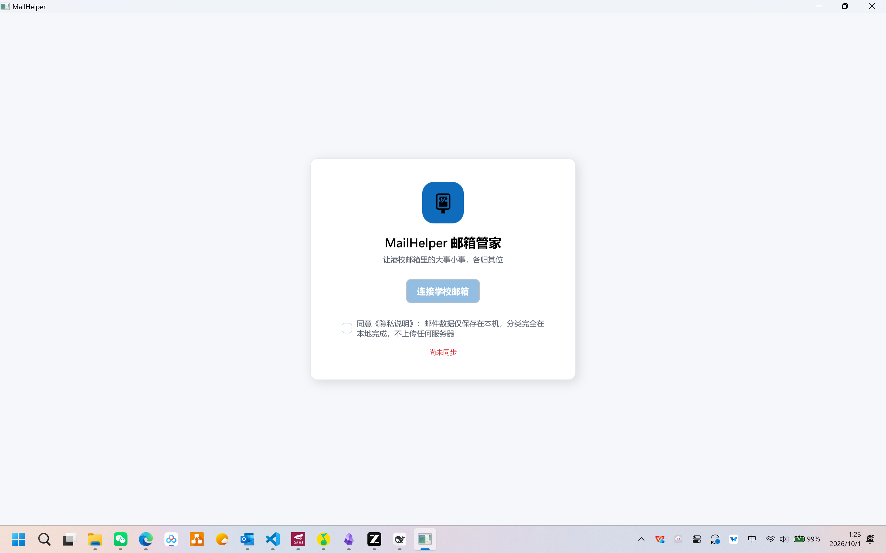

# MailHelper 使用手册

> 面向港校学生的完整使用指南。安装、登录、分类、通知、规则、更新——一次讲清。
> 遇到问题先看[常见问题](#常见问题-faq)，仍解决不了请到 [Issues](https://github.com/tendernessnick/mail_helper/issues) 提问。

---

## 目录

1. [MailHelper 是什么](#1-mailhelper-是什么)
2. [安装与首次启动](#2-安装与首次启动)
3. [界面导览](#3-界面导览)
4. [收件箱与同步](#4-收件箱与同步)
5. [分类与重要度](#5-分类与重要度)
6. [阅读邮件](#6-阅读邮件)
7. [改判：教它越用越懂你](#7-改判教它越用越懂你)
8. [规则页：自己定分类规则](#8-规则页自己定分类规则)
9. [自定义类别](#9-自定义类别)
10. [新邮件通知](#10-新邮件通知)
11. [托盘与后台运行](#11-托盘与后台运行)
12. [设置详解](#12-设置详解)
13. [更新应用](#13-更新应用)
14. [隐私与数据安全](#14-隐私与数据安全)
15. [常见问题 FAQ](#常见问题-faq)
16. [已知限制](#已知限制)
17. [附录](#附录)

---

## 1. MailHelper 是什么

港校录取后，你的学校邮箱会被海量邮件淹没：课程通知、实习招聘、缴费提醒、行政事务、订阅广告……重要的邮件往往一闪而过。

**MailHelper 邮箱管家**是一款 Windows 桌面应用，它帮你：

- **自动同步**学校邮箱——经你电脑上**已登录的经典版 Outlook** 读取，增量同步
- **自动分类**到「课程学习 / 职业发展 / 校园事务 / 财务缴费 / 通知公告 / 订阅营销 / 其他」七大类
- **标注重要度** P0（紧急）～ P3（低），P0 缴费截止、面试邀约这类邮件第一时间弹通知
- **全部在本地完成**：邮件数据只存在你的电脑上，分类不经过任何服务器，无遥测

> **⚠️ 使用前提**：本机需安装并登录**经典版 Outlook**（Office 桌面版自带的 Outlook 桌面客户端），且其中已配置好学校邮箱。不支持新版 Outlook for Windows 和网页版。

## 2. 安装与首次启动

### 2.1 下载安装

1. 打开[ Releases 下载页](https://github.com/tendernessnick/mail_helper/releases/latest)（永远指向最新正式版）
2. 下载 `MailHelper-stable-Setup.exe`，双击运行
3. 跟着向导走：隐私说明 → **选择安装位置**（默认 `%LocalAppData%\Programs\MailHelper`，可改成任意目录）→ 附加任务（桌面快捷方式）→ 安装完成
4. 系统要求：**本机安装并登录经典版 Outlook**（Office 桌面版）；Windows 10 (19041+) / Windows 11；WebView2 Runtime（Win11 自带，缺失时安装器会检测并引导安装）

> **SmartScreen 提示「已保护你的电脑」？** 本软件暂未购买代码签名证书。点「更多信息」→「仍要运行」即可；安装前可对照发布页 `SHA256SUMS.txt` 核对文件校验值。

> **装到哪了？** 默认在 `%LocalAppData%\Programs\MailHelper`（当前用户目录，不需要管理员权限），向导里可以改成任意目录。卸载在「设置 → 应用」里进行，卸载时会询问是否一并删除本地数据。

免安装用户可选 `MailHelper-stable-Portable.zip`，解压后直接运行（更新需手动重新下载）。

### 2.2 连接学校邮箱

MailHelper **没有账号密码登录环节**——它直接复用你电脑上经典版 Outlook 的已登录状态：

1. **先确保经典版 Outlook 能正常收发学校邮件**（安装了 Office 桌面版、配置了学校邮箱账户、至少打开过一次）
2. 在 MailHelper 欢迎卡片上勾选**《隐私说明》**（邮件数据仅保存在本机，分类完全在本地完成，不上传任何服务器）
3. 点**「连接学校邮箱」**——MailHelper 自动探测 Outlook 里登录的学校账户，连上后立即开始首轮同步

> 连不上？看欢迎卡片上的红色提示：多半是经典版 Outlook 没打开、没配置学校账户，或装的是新版 Outlook for Windows。把经典版 Outlook 打开并登录好后，回到 MailHelper 重试即可。

首次连接会同步最近邮件（视邮箱大小需几分钟），之后的同步都是增量进行。登录成功后进入主界面，之后**每次开机 MailHelper 都会安静地帮你盯邮箱**。

## 3. 界面导览

| 区域 | 说明 |
| --- | --- |
| **顶栏** | 「收件箱 / 规则 / 设置」三个页签；中间搜索框（`Ctrl+F` 快速聚焦）；右侧「仅未读」筛选 |
| **左栏·类别导航** | 「收件箱（全部）」「待确认」+ 七个分类（可自定义），每项右侧数字是**未读数** |
| **中栏·邮件列表** | 每封邮件显示发件人头像、主题、摘要预览、时间；左侧圆点 = 未读；`P0/P1/P2` 色块 = 重要度；📎 = 有附件 |
| **右栏·阅读窗格** | 点选邮件后显示正文；底部「改为…」按钮用于纠正分类 |
| **底部状态栏** | 左侧是同步状态（就绪 / 正在同步… / 离线 / 同步失败 / 需要重新登录），右侧「⟳ 立即同步」按钮 |

## 4. 收件箱与同步

- **自动同步**：默认每 5 分钟增量同步一次新邮件，可在设置中调整（1–60 分钟）
- **立即同步**：快捷键 `Ctrl+R`，或点右下角「⟳ 立即同步」
- **启动时同步**：可在设置中开启/关闭（默认开启）
- **断点续传**：同步中断不会丢邮件也不会重复拉取，下次自动从断点继续

状态栏常见状态：

| 状态 | 含义 | 处理 |
| --- | --- | --- |
| 就绪 / 正在同步… | 正常 | 无需处理 |
| 离线 | 网络不通，会自动重试 | 检查网络 |
| 同步失败 · 错误码 | 服务器或网络异常 | 悬停查看详情，稍后自动重试 |
| 需要重新登录 | 授权过期或密码已改 | 见 FAQ「提示需要重新登录」 |

## 5. 分类与重要度

### 5.1 分类

左栏从上到下：

| 分类 | 收什么 |
| --- | --- |
| **收件箱（全部）** | 所有邮件，未读总数显示在右侧 |
| **待确认** | 规则引擎「拿不准」的邮件——证据不足或两类打平，等你人工看一眼 |
| **课程学习** | 课件、作业、测验、考试安排（Moodle / Canvas / 课程群发件人） |
| **职业发展** | 实习、招聘、面试邀约、Career Fair、简历工作坊 |
| **校园事务** | 签证、注册、图书馆、学生事务处等行政邮件 |
| **财务缴费** | 学费账单、缴费提醒、分期付款 |
| **通知公告** | 校园公告、讲座、活动预告 |
| **订阅营销** | 电子报、优惠推广（低优先级，闲时再看） |
| **其他** | 同学聊天、无关邮件等 |

分类由**本地规则引擎**完成（内置百余条针对港校邮箱调优的规则：发件人、域名、主题关键词、正则加权评分）。当一类证据明显领先（阈值判定）才归入该类，否则放入「待确认」——**宁可让你多看一眼，不让重要邮件溜走**。

### 5.2 重要度

| 级别 | 含义 | 典型例子 | 通知策略 |
| --- | --- | --- | --- |
| **P0** | 紧急 | 缴费逾期、签证截止、考试变更 | 每封立即弹窗 |
| **P1** | 重要 | 面试邀约、作业截止提醒 | 聚合通知（见[第 10 节](#10-新邮件通知)） |
| **P2** | 普通 | 日常通知、课件上传 | 不弹通知 |
| **P3** | 低 | 订阅营销、电子报 | 不弹通知 |

## 6. 阅读邮件

在中栏点选任意邮件：

- **自动标记已读**，左栏未读数随之减少
- 正文在右侧窗格渲染，支持中英文
- 📎 图标提示该邮件带附件

> **为什么正文里的链接点不了？** 这是刻意的安全设计（防钓鱼）：MailHelper 只渲染正文的本地副本，邮件内的外链一律不跳转。需要打开链接时，请到 Outlook 网页版或经典客户端操作。

## 7. 改判：教它越用越懂你

分错了？两秒纠正：

1. 选中邮件，在阅读窗格底部点**「改为…」**
2. 选择正确类别

改判**立即生效**，并且 MailHelper 会**自动学习**：同发件人后续邮件直接归入你选的类别（在规则页能看到它生成的「反馈生成」规则）。状态栏会提示「已改判为「财务缴费」；同发件人后续邮件将自动归入该类别」。

你的改判**永远不会被规则包升级覆盖**——内置规则升级重新分类时，历史改判依然保留。

## 8. 规则页：自己定分类规则

顶栏切到「规则」，这里是所有分类规则的清单：

- **筛选**：全部 / 内置（随应用分发，只读）/ 自定义（你手建的）/ 反馈生成（改判自动学到的）
- **新建规则**：点「+ 新建规则」，四种类型任选
  | 类型 | 示例 | 适合场景 |
  | --- | --- | --- |
  | 发件人地址 | `careers@hku.hk` | 精确匹配某个发件人 |
  | 发件人域名 | `@moodle.cuhk.edu.hk` | 整个域都归一类 |
  | 主题关键词 | `缴费` | 按主题词匹配 |
  | 主题正则 | `(deadline|截止)` | 高级：模式匹配主题 |
- 每条规则可设：**目标类别**、**重要度建议**、**权重**（越高话语权越大）、**启用**开关
- **试跑预览**：保存前可对最近 100 封邮件试跑，立刻看到「试跑命中 N 封」，避免误伤
- 自定义/反馈规则可编辑、停用、删除；内置规则不可修改（但可停用整个类别下的证据权重由系统管理，无需干预）

## 9. 自定义类别

内置七类不满足需求？设置 → 自定义类别：

- 输入**名称**、选一个**图标**（emoji）和**颜色**，点「添加」
- 新类别立刻出现在左栏分类导航、邮件「改为…」菜单和规则编辑的目标类别里
- **删除类别**时，该类下的邮件自动归入「其他」，指向它的规则一并删除（内置七类不可删）

## 10. 新邮件通知

新邮件到达时（每轮同步后）按重要度决定是否弹 Windows 通知：

- **P0 紧急**：每封单独弹窗，绝不合并
- **P1 重要**：一轮同步里到 3 封及以上时合并成一条摘要（少于 3 封逐封弹）
- **P2/P3**：不弹通知，只在应用内查看
- **点击通知**直达对应邮件（标记已读 + 打开阅读窗格）
- **勿扰时段**：设置里可配（如 `23:00-07:00`），时段内的通知先排队，结束后补发一条摘要
- P0 / P1 通知均可在设置中单独关闭

> **首轮静默**：刚连接邮箱的第一次同步只登记不弹窗——否则新用户会被历史邮件的通知轰炸。从第二轮同步起正常通知。

## 11. 托盘与后台运行

MailHelper 为「常驻后台」设计：

- **点 × 关闭窗口 ≠ 退出**：应用继续在系统托盘值守、同步和弹通知
- **单击托盘图标**唤起主界面；图标右下角显示**未读角标**数字
- **右键托盘菜单**：打开主界面 / 立即同步（`Ctrl+R`）/ 退出
- 想彻底退出：托盘右键 →「退出」
- 想开机自动值守：设置 → 高级 → 勾选**开机自启**

## 12. 设置详解

| 分组 | 设置项 | 说明 |
| --- | --- | --- |
| **账户** | 邮箱 / 接入通道 / 上次同步 | 当前账户与通道状态（接入通道恒为「经典版 Outlook」） |
| | 清除本地数据… | **删除全部**邮件缓存、规则、设置，不可恢复，需二次确认 |
| **同步** | 同步间隔（分钟） | 1–60，改完即刻生效，无需重启 |
| | 启动时立即同步 | 打开应用就先拉一轮新邮件 |
| **通知** | P0 紧急通知 / P1 重要通知 | 两级开关 |
| | 勿扰时段 | 格式 `23:00-07:00`，留空禁用 |
| **外观** | 语言 | 跟随系统 / 简体中文 / English（切换后重启完全生效） |
| | 主题 | 跟随系统 / 浅色 / 深色 |
| **自定义类别** | 添加 / 删除 | 见[第 9 节](#9-自定义类别) |
| **高级** | 开机自启 | 写入 Windows 启动项 |
| | 诊断日志 | Debug 级日志（含完整发件人地址），排障时开启 |
| | 正文缓存上限（MB） | 正文本地缓存占用的天花板 |
| **关于** | 当前版本 / 检查更新 | 见[第 13 节](#13-更新应用) |

## 13. 更新应用

- 打开 **设置 → 关于 → 「检查更新」**
- 有新版本时自动后台下载完整安装包（约 75MB，含下载进度），完成后点**「重启并安装更新」**——应用退出、静默完成覆盖安装并自动重启，数据与设置全保留
- 只接收**正式版**；想尝鲜可在 [Releases 页](https://github.com/tendernessnick/mail_helper/releases)下载标记为 Pre-release 的 beta（稳定性不作保证）
- 也可以随时从 [releases/latest](https://github.com/tendernessnick/mail_helper/releases/latest) 手动下载最新安装包覆盖安装（向导内可重选目录）

## 14. 隐私与数据安全

这是 MailHelper 的底线设计：

- **数据全本地**：邮件缓存、分类结果、规则、设置全部存在 `%AppData%\MailHelper\`，卸载或「清除本地数据」即全部删除
- **零遥测**：不上传任何统计、行为、内容数据
- **不存任何凭据**：没有账号密码登录环节，同步复用本机经典版 Outlook 的登录态；你的密码只在微软侧，MailHelper 既看不到也不保存任何令牌
- **防钓鱼**：正文中外链一律不跳转（见[第 6 节](#6-阅读邮件)）
- **分类全本地**：规则引擎在本地运行，邮件内容不会被发往任何 AI/云端服务

## 常见问题 FAQ

**Q：点「连接学校邮箱」提示连接失败 / 读不到本机 Outlook？**
依次检查：① 本机装的是**经典版 Outlook**（Office 桌面版）——新版 Outlook for Windows 和网页版**不支持**；② 经典版 Outlook 里已配置学校邮箱并能正常收发；③ 至少打开过一次 Outlook。都满足后回 MailHelper 重试。

**Q：状态栏提示同步异常 / 邮件不更新？**
确认经典版 Outlook 处于打开状态且能正常收发（MailHelper 经它读取）。若 Outlook 里也收不到新邮件，先解决 Outlook 本身的问题（网络、账户配置）。

**Q：收不到新邮件通知？**
依次检查：① 设置 → 通知，对应级别开关是否打开（P2/P3 本来就不弹）；② 勿扰时段是否覆盖当前时间（时段内会排队、结束后补发摘要）；③ 刚连接邮箱的第一轮同步是静默的（防历史邮件轰炸），第二轮起正常。

**Q：换了 Outlook 密码，MailHelper 要怎么处理？**
在经典版 Outlook 里重新登录学校账户即可，MailHelper 下轮同步自动恢复，无需任何操作。

**Q：分类不准 / 重要邮件进了「待确认」？**
用「改为…」纠正一次，同发件人立即生效；高频误判可在规则页自建规则。「待确认」是引擎对证据不足邮件的保守处理——宁可多看一眼，不让大事溜走。

**Q：换了电脑，数据怎么办？**
新电脑装好经典版 Outlook 并登录学校账户后，安装 MailHelper 连接即可（邮件会重新同步）；本机的分类缓存不跨设备同步（隐私设计）。

**Q：想彻底删掉所有本地数据？**
设置 → 账户 → 「清除本地数据…」，二次确认后删除全部缓存、规则、设置与令牌。

**Q：装完想去哪看安装目录 / 想换位置？**
默认装在 `%LocalAppData%\Programs\MailHelper`，安装向导里可自行修改。装完想换位置：直接重新运行安装包，在目录页改成新位置即可（数据不受影响）。

**Q：杀毒软件 / SmartScreen 拦截安装包？**
无签名程序的正常提示。核对发布页 `SHA256SUMS.txt` 中的校验值后选择运行即可。

**Q：卸载后数据会残留吗？**
数据都在 `%AppData%\MailHelper\`，卸载后手动删除该文件夹即可彻底清理。

## 已知限制

- 暂不感知远端的删除与移动（在网页版 Outlook 删掉的邮件不会从本地消失）
- 仅支持经典版 Outlook（Office 桌面版）；新版 Outlook for Windows 与网页版不受支持
- 语言切换需要重启应用才完全生效
- 安装包未做代码签名，首次运行有 SmartScreen 提示
- 阅读窗格内外链不可点击（安全设计，非缺陷）

## 附录

### 数据目录

`%AppData%\MailHelper\`：`mailhelper.db`（邮件/规则/设置）、`bodies\`（正文缓存）、`tokens\`（加密令牌）、`logs\`（运行日志）。

### 同步方式（CHG-013 起）

MailHelper 仅经**本机经典版 Outlook** 同步学校邮箱（COM 读取已登录账户，零 OAuth 环节）。0.4.x 时代的 Graph / IMAP XOAUTH2 通道已在 v0.5.0 移除。

### 开发者模式

设置环境变量 `MAILHELPER_DEV=1` 启动应用，将使用假令牌与种子邮件驱动完整链路（无需真实账号），用于开发与界面冒烟。日常使用请勿开启。

---

*MailHelper 邮箱管家 · 让港校邮箱里的大事小事，各归其位 · [更新日志](../CHANGELOG.md) · [MIT License](../LICENSE)*
